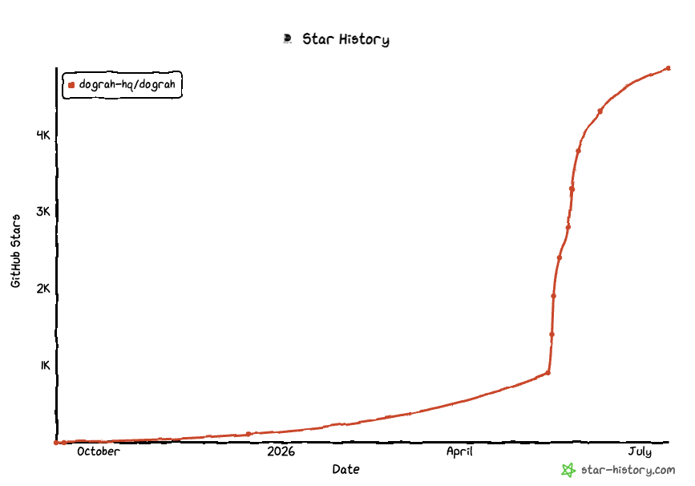

# Dograh AI

> **CALMOS Connect white-label v1.46.0.4.2.CFix2** ([applied-biosciences/dograh](https://github.com/applied-biosciences/dograh)): this fork adds the Sakinah Scenario Console, AI-to-AI simulation, durable call storage, privacy-controlled memory, and scenario search — see [`SAKINAH.md`](SAKINAH.md) and [`docs/developer/calmos-connect-v1.46.0.3.mdx`](docs/developer/calmos-connect-v1.46.0.3.mdx).
> **Deployment limitation**: run the API with a **single worker** (`FASTAPI_WORKERS=1`, the default). Simulations keep in-process state, so with multiple workers the simulation status/stop endpoints and the transcript/audio WebSockets intermittently land on a worker that doesn't own the simulation ([#4](https://github.com/applied-biosciences/dograh/issues/4)).

<p align="center">
  <a href="https://www.producthunt.com/products/dograh">
    
  </a>
</p>

**The open-source, self-hostable alternative to Vapi & Retell** — build production voice agents with a visual workflow builder, test them in minutes, and let AI coding assistants help design and edit them through MCP.

<p align="center">
  <a href="https://app.dograh.com">
    
  </a>
  &nbsp;
  <a href="#-get-started">
    
  </a>
  &nbsp;
  <a href="https://join.slack.com/t/dograh-community/shared_invite/zt-4787daqcn-3TDiQUh~3xrr3pwAqR9wpQ">
    
  </a>
</p>

<p align="center">
  <a href="https://docs.dograh.com">📖 Docs</a> &nbsp;·&nbsp;
  <a href="LICENSE">📜 BSD 2-Clause</a> &nbsp;·&nbsp;
  <a href="README.zh-CN.md">🌐 中文</a> &nbsp;·&nbsp;
  <a href="README.ja-JP.md">🌐 日本語</a>
</p>

<p align="center">
  
</p>

- **100% open source**, self-hostable — no vendor lock-in, unlike Vapi or Retell
- **Full control & transparency** — every line of code is open, with flexible LLM / TTS / STT integration
- **Maintained by YC alumni and exit founders**, committed to keeping voice AI open

<p align="center">
  <a href="https://www.producthunt.com/products/dograh?embed=true&utm_source=badge-top-post-badge&utm_medium=badge&utm_campaign=badge-dograh-3" target="_blank"></a>
  &nbsp;
  <a href="https://www.producthunt.com/products/dograh?embed=true&utm_source=badge-top-post-badge&utm_medium=badge&utm_campaign=badge-dograh-3" target="_blank"></a>
  <br />
  <a href="https://www.producthunt.com/products/dograh?embed=true&utm_source=badge-top-post-badge&utm_medium=badge&utm_campaign=badge-dograh-3" target="_blank"></a>
  &nbsp;
  <a href="https://www.producthunt.com/products/dograh?embed=true&utm_source=badge-top-post-topic-badge&utm_medium=badge&utm_campaign=badge-dograh-3" target="_blank"></a>
  <br />
  <a href="https://trendshift.io/repositories/31007" target="_blank"></a>
</p>

## 🎥 Featured

<div align="center">
  <a href="https://www.youtube.com/watch?v=xD9JEvfCH9k">
    
  </a>
  <br>
  <em>Featured by <strong>Better Stack</strong> — a hands-on look at Dograh</em>
</div>

<details>
<summary>📺 Prefer a 2-minute product walkthrough? Click here.</summary>

<div align="center">
  <a href="https://youtu.be/9gPneyf9M9w">
    
  </a>
</div>

</details>

## ⚖️ Dograh vs Vapi vs Retell

An honest comparison on the axes that matter most to teams evaluating voice AI platforms.

|  | **Dograh** | **Vapi** | **Retell** |
|---|---|---|---|
| **License** | BSD 2-Clause (open source) | Proprietary | Proprietary |
| **Self-hostable** | ✅ Yes — one Docker command | ❌ SaaS only | ❌ SaaS only |
| **Pricing** | Free (self-host) · usage-based (cloud) | Per-minute SaaS | Per-minute SaaS |
| **Bring your own LLM / STT / TTS** | ✅ Any provider, or use Dograh's stack | Configurable within their integrations | Configurable within their integrations |
| **Source-level customization** | ✅ Every line is yours to modify | ❌ Closed source | ❌ Closed source |
| **Data residency** | Your infra, your rules | Their cloud | Their cloud |
| **Vendor lock-in** | None | Full | Full |


## 🚀 Get Started

##### Download and setup Dograh on your Local Machine

> **Note**
> We collect anonymous usage data to improve the product. You can opt out by setting `ENABLE_TELEMETRY=false` before running the startup script.

> **Note**
> If you wish to run the platform on a remote server instead, checkout our [Documentation](https://docs.dograh.com/deployment/docker#option-2:-remote-server-deployment)

```bash
curl -o docker-compose.yaml https://raw.githubusercontent.com/dograh-hq/dograh/main/docker-compose.yaml && curl -o start_docker.sh https://raw.githubusercontent.com/dograh-hq/dograh/main/scripts/start_docker.sh && chmod +x start_docker.sh && ./start_docker.sh
```

> **⚡ Prefer an AI agent to set it up for you?**
> If you use **Claude Code** or **Codex**, install the official [Dograh setup skill](https://github.com/dograh-hq/dograh-plugins) and let your agent handle installation, configuration, and troubleshooting — it detects your OS, picks the right deploy path, runs Dograh's own setup scripts, and verifies the result.
>
> ```text
> # In Claude Code
> /plugin marketplace add dograh-hq/dograh-plugins
> /plugin install dograh@dograh
> ```
>
> Then start a new session and ask it to _"set up Dograh"_ (or run `/dograh-setup`). Codex is supported too — see the [plugin repo](https://github.com/dograh-hq/dograh-plugins#install).

> **Note**
> First startup may take 2-3 minutes to download all images. Once running, open http://localhost:3010 to create your first AI voice assistant!
> For common issues and solutions, see 🔧 **[Troubleshooting](docs/getting-started/troubleshooting.mdx)**.

### 🎙️ Your First Voice Bot

1. Open [http://localhost:3010](http://localhost:3010) in your browser.
2. Pick **Inbound** or **Outbound**, name your bot (e.g. _Lead Qualification_), and describe the use case in 5–10 words (e.g. _Screen insurance form submissions for purchase intent_).
3. Click **Test Agent**.
4. Use **Test Audio** to talk to your agent in the browser, or **Test Chat** to iterate faster in text. In Test Chat, you can edit or replay user turns and Dograh will regenerate the agent's replies and node transitions from that point.

> 🔑 **No API keys needed.** Dograh ships with auto-generated keys and its own LLM / TTS / STT stack. Connect your own keys for LLM, TTS, STT, or Telephony (e.g. Twilio, Vonage, Telnyx) anytime.

> **Featured On & Community Validation:** Dograh was named **[#1 Product of the Day on Product Hunt](https://www.producthunt.com/products/dograh)**.

## CALMOS / Sakinah Scenario Console

CALMOS Connect v1.46.0.4.2.CFix2 includes the Sakinah Scenario Console at `/sakinah` and
its AI-to-AI simulation console at `/sakinah/sim`. The white-label release adds:

- Durable Agent Runs/Call History records for active and completed calls,
  including transcripts, utterances, scores, events, latency, and provider
  metadata.
- Private recording and transcript storage with server-generated, short-lived
  playback/download links. Local Docker uses MinIO; production deployments can
  use encrypted AWS S3 without exposing credentials or public object URLs.
- A privacy-controlled Sakinah memory layer backed by PostgreSQL pgvector,
  stable service-user identities, provenance, retention, and caller states
  (`UNKNOWN`, `FIRST_TIME`, `RECOGNISED`, and `VERIFIED`).
- Scenario Library search across names, descriptions, categories, tags,
  identifiers, and relevant scenario text, with filtering performed server-side
  for database-backed libraries.

Both consoles show durable run history with conversation previews and signed
download controls for available recordings and transcripts. Call persistence
and memory extraction are asynchronous so long-term storage is not on the
real-time audio → STT → LLM → TTS response path.

Administrators can open `/sakinah/scenarios` to bulk-import scenario JSON files
from a ZIP or from multiple individual files. The importer validates every JSON
independently, previews duplicates before committing, and preserves UTF-8 text,
Arabic content, and intentional leading metadata such as `***` in scenario
titles. See [`SAKINAH.md`](SAKINAH.md) for local setup and deployment details.

## Build Agents with MCP

Dograh ships with an MCP server, so coding agents can work directly inside your Dograh workspace.

Connect Codex, Claude Code, Cursor, or any MCP client to inspect existing agents, search Dograh docs, fetch node schemas, create new workflows, and save draft edits from natural language.

When asking your coding agent to build a voice agent, share a short script for
the use case instead of only a one-line prompt. Include the agent persona, call
flow, rules, objection handling, success criteria, and a sample conversation if
you have one.

See the [MCP guide](https://docs.dograh.com/integrations/mcp) to connect your assistant.

## Features

### Voice Agent Builder

- Visual workflow builder with start nodes, agent nodes, global instructions, tools, transitions, and end-call outcomes
- Test Agent panel with **Test Audio** for browser voice testing and **Test Chat** for fast prompt iteration
- QA node, knowledge bases, webhooks, embeds, and tool calling for production workflows

### Voice & Telephony

- Built-in telephony integrations including Twilio, Vonage, Telnyx, Plivo, Vobiz, Cloudonix, and Asterisk ARI
- Human handoff with call transfer on supported telephony providers
- Bring your own LLM, TTS, STT, and telephony providers; store artifacts in bundled MinIO or AWS/S3-compatible storage

### Developer Experience

- One-command Docker setup for self-hosting
- Python backend and modular provider architecture for customization
- Python and Node SDKs for programmatic agent creation and outbound calls

## Deployment Options

### Local Development

Refer to [Local Setup](https://docs.dograh.com/contribution/setup). To run the
white-label source checkout with Docker:

```bash
docker compose -f docker-compose.yaml -f docker-compose.local-build.yaml build api ui
docker compose -f docker-compose.yaml -f docker-compose.local-build.yaml up -d api ui
```

Then open [http://localhost:3010](http://localhost:3010). The local stack keeps
PostgreSQL, Redis, and MinIO data in Docker volumes; do not use `down -v` unless
you intend to erase local call records and recordings.

### Self-Hosted Deployment

For detailed deployment instructions including remote server setup with HTTPS, see our [Docker Deployment Guide](https://docs.dograh.com/deployment/docker#option-2-remote-server-deployment).
For the CALMOS Connect v1.46.0.4.2.CFix2 data model, AWS storage configuration, memory
privacy flow, replay flow, migrations, and rollback procedure, see
[`docs/developer/calmos-connect-v1.46.0.3.mdx`](docs/developer/calmos-connect-v1.46.0.3.mdx).

### Cloud Version

Visit [https://www.dograh.com](https://www.dograh.com/) for our managed cloud offering.

## 📚Documentation

You can go to [https://docs.dograh.com](https://docs.dograh.com/) for our documentation.

## 📦 SDKs

- **Python SDK** — [pypi.org/project/dograh-sdk](https://pypi.org/project/dograh-sdk/)
- **Node SDK** — [npmjs.com/package/@dograh/sdk](https://www.npmjs.com/package/@dograh/sdk)

## 🤝Community & Support

> 👋 **Coming from the Better Stack video?** Drop your use case in our [pinned GitHub Discussion](https://github.com/orgs/dograh-hq/discussions/291) — we read every reply and the founders personally onboard early adopters.

- **Slack** — the cornerstone of Dograh AI contributions. Connect with maintainers, discuss features before coding, get help with setup, and stay current on contribution sprints.
- **GitHub Discussions** — share use cases, ask questions, swap workflow recipes.
- **GitHub Issues** — report bugs or request features.

👉 Join us → [Dograh Community Slack](https://join.slack.com/t/dograh-community/shared_invite/zt-4787daqcn-3TDiQUh~3xrr3pwAqR9wpQ)

## 🙌 Contributing

We love contributions! Dograh AI is 100% open source and we intend to keep it that way.

### Getting Started

- Fork the repository
- Create your feature branch (git checkout -b feature/AmazingFeature)
- Commit your changes (git commit -m 'Add some AmazingFeature')
- Push to the branch (git push origin feature/AmazingFeature)
- Open a Pull Request

## ⭐ Star History



## 📄 License

Dograh AI is licensed under the [BSD 2-Clause License](LICENSE)- the same license as projects that were used in building Dograh AI, ensuring compatibility and freedom to use, modify, and distribute.

## 🏢 About

Built with ❤️ by **Dograh** (Zansat Technologies Private Limited)
Founded by YC alumni and exit founders committed to keeping voice AI open and accessible to everyone.

<br><br><br>

  <p align="center">
    <a href="https://github.com/dograh-hq/dograh">⭐ Star us on GitHub</a> |
    <a href="https://app.dograh.com">☁️ Try Cloud Version</a> |
    <a href="https://join.slack.com/t/dograh-community/shared_invite/zt-4787daqcn-3TDiQUh~3xrr3pwAqR9wpQ">💬 Join Slack</a>
  </p>
