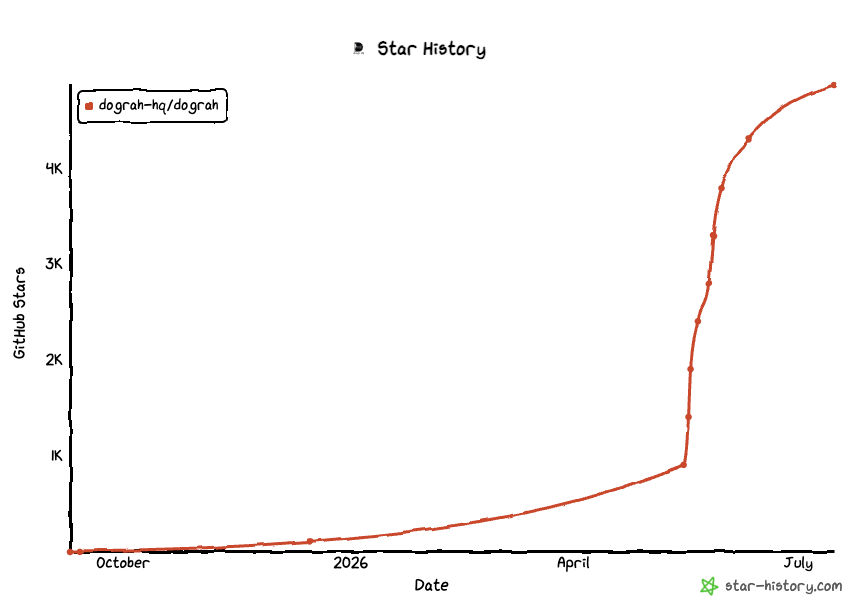

# Dograh AI

> 💡 **Notice**: This documentation is community-maintained. If you spot any translation inaccuracies or content that has drifted from the English version, please feel free to open a PR!
>
> 💡 **提示**:本文档由社区共同维护。如果您发现翻译不准确,或与英文版本存在出入,欢迎随时提交 PR!

**开源、可自托管的 Vapi 与 Retell 替代方案** —— 使用可视化工作流构建器搭建生产级语音智能体,几分钟内完成测试,并让 AI 编码助手通过 MCP 帮你设计和编辑。

<p align="center">
  <a href="https://app.dograh.com">
    
  </a>
  &nbsp;
  <a href="#-快速开始">
    
  </a>
  &nbsp;
  <a href="https://join.slack.com/t/dograh-community/shared_invite/zt-3zjb5vwvl-j7hRz3_F1SOn5cH~jm5f5g">
    
  </a>
</p>

<p align="center">
  <a href="https://docs.dograh.com">📖 文档</a> &nbsp;·&nbsp;
  <a href="LICENSE">📜 BSD 2-Clause</a> &nbsp;·&nbsp;
  <a href="README.md">🌐 English</a> &nbsp;·&nbsp;
  <a href="README.ja-JP.md">🌐 日本語</a>
</p>

<p align="center">
  
</p>

- **100% 开源**,可自托管 —— 不像 Vapi 或 Retell,没有任何厂商绑定
- **完全可控且透明** —— 每一行代码都是开放的,LLM / TTS / STT 集成灵活可换
- **由 YC 校友与连续创业者维护**,致力于让语音 AI 始终保持开放

## 🎥 媒体推荐

<div align="center">
  <a href="https://www.youtube.com/watch?v=xD9JEvfCH9k">
    
  </a>
  <br>
  <em><strong>Better Stack</strong> 上手实测 —— 深入体验 Dograh</em>
</div>

<details>
<summary>📺 想看 2 分钟产品快速演示?点这里。</summary>

<div align="center">
  <a href="https://youtu.be/9gPneyf9M9w">
    
  </a>
</div>

</details>

## ⚖️ Dograh vs Vapi vs Retell

针对正在评估语音 AI 平台的团队,这里是一份在最关键的维度上诚实的对比。

|  | **Dograh** | **Vapi** | **Retell** |
|---|---|---|---|
| **协议** | BSD 2-Clause(开源) | 闭源 | 闭源 |
| **可自托管** | ✅ 可以 —— 一条 Docker 命令 | ❌ 仅 SaaS | ❌ 仅 SaaS |
| **定价** | 免费(自托管)·按用量计费(云端) | 按分钟计费的 SaaS | 按分钟计费的 SaaS |
| **自带 LLM / STT / TTS** | ✅ 任意厂商,也可使用 Dograh 自带方案 | 在其集成范围内可配置 | 在其集成范围内可配置 |
| **源码级定制** | ✅ 每行代码都可自由修改 | ❌ 闭源 | ❌ 闭源 |
| **数据驻留** | 部署在自家基础设施,规则自己定 | 厂商云端 | 厂商云端 |
| **厂商绑定** | 无 | 完全绑定 | 完全绑定 |


## 🚀 快速开始

##### 在本地机器下载并部署 Dograh

> **提示**
> 我们会收集匿名使用数据以改进产品。如需关闭,请在下面的命令中将 `ENABLE_TELEMETRY` 设为 `false`。

> **提示**
> 如果希望在远程服务器上运行该平台,请参考[文档](https://docs.dograh.com/deployment/docker#option-2:-remote-server-deployment)。

```bash
curl -o docker-compose.yaml https://raw.githubusercontent.com/dograh-hq/dograh/main/docker-compose.yaml && REGISTRY=ghcr.io/dograh-hq ENABLE_TELEMETRY=true docker compose up --pull always
```

> **⚡ 想让 AI 智能体帮你完成部署?**
> 如果你使用 **Claude Code** 或 **Codex**,可以安装官方的 [Dograh 部署技能(skill)](https://github.com/dograh-hq/dograh-plugins),让智能体替你完成安装、配置与排障——它会识别你的操作系统、选择合适的部署方式、运行 Dograh 自带的部署脚本并验证结果。
>
> ```text
> # 在 Claude Code 中
> /plugin marketplace add dograh-hq/dograh-plugins
> /plugin install dograh@dograh
> ```
>
> 然后开启一个新会话,让它 _"set up Dograh"_(或运行 `/dograh-setup`)。Codex 同样支持——详见[插件仓库](https://github.com/dograh-hq/dograh-plugins#install)。

> **提示**
> 首次启动需要 2-3 分钟拉取所有镜像。启动完成后,打开 http://localhost:3010 即可创建你的第一个 AI 语音助手!
> 常见问题及解决方案请参见 🔧 **[故障排查](docs/getting-started/troubleshooting.mdx)**。

### 🎙️ 你的第一个语音机器人

1. 在浏览器中打开 [http://localhost:3010](http://localhost:3010)。
2. 选择 **Inbound(呼入)** 或 **Outbound(外呼)**,为机器人命名(例如 _销售线索筛选_),再用 5-10 个词描述用途(例如 _筛选保险表单中的购买意向_)。
3. 点击 **Test Agent**。
4. 使用 **Test Audio** 在浏览器中和智能体语音对话,或使用 **Test Chat** 通过文本快速迭代。在 Test Chat 中,你可以编辑或重放用户消息,Dograh 会从该位置重新生成智能体回复和节点流转。

> 🔑 **无需 API Key。** Dograh 自带一套自动生成的密钥,以及内置的 LLM / TTS / STT 栈。你可以随时接入自己的 LLM、TTS、STT 或电信服务商(如 Twilio、Vonage、Telnyx)。

## 使用 MCP 构建智能体

Dograh 内置 MCP 服务器,因此编码智能体可以直接在你的 Dograh 工作区中操作。

连接 Codex、Claude Code、Cursor 或任何 MCP 客户端后,可以查看现有智能体、搜索 Dograh 文档、获取节点 schema、创建新工作流,并通过自然语言保存草稿修改。

让编码智能体构建语音智能体时,请分享一份面向该用例的简短脚本,而不是只给一行提示。脚本最好包含智能体 persona、通话流程、规则、异议处理、成功标准,以及可选的示例对话。

请参见 [MCP 指南](https://docs.dograh.com/integrations/mcp) 来连接你的助手。

## 功能特性

### 语音智能体构建器

- 可视化工作流构建器,支持 start 节点、agent 节点、全局指令、工具、跳转和结束通话结果
- Test Agent 面板内置 **Test Audio** 用于浏览器语音测试,并提供 **Test Chat** 用于快速提示词迭代
- 面向生产工作流的 QA 节点、知识库、webhook、嵌入和工具调用

### 语音与电信

- 内置 Twilio、Vonage、Telnyx、Plivo、Vobiz、Cloudonix 和 Asterisk ARI 等电信集成
- 在支持的电信服务商上,可通过通话转接实现人工接管
- 可接入自己的 LLM、TTS、STT 和电信服务商;通话产物可存储在内置 MinIO 或 AWS / S3 兼容存储中

### 开发者体验

- 一条命令即可完成自托管 Docker 部署
- Python 后端和模块化 provider 架构,便于定制
- Python 和 Node SDK,用于以编程方式创建智能体并发起外呼

## 部署方式

### 本地开发

参见[本地部署](https://docs.dograh.com/contribution/setup)。

### 自托管部署

如需了解远程服务器部署及 HTTPS 配置的详细步骤,请参见我们的 [Docker 部署指南](https://docs.dograh.com/deployment/docker#option-2-remote-server-deployment)。

### 云端版本

托管云版本请访问 [https://www.dograh.com](https://www.dograh.com/)。

## 📚 文档

完整文档请访问 [https://docs.dograh.com](https://docs.dograh.com/)。

## 🤝 社区与支持

> 👋 **从 Better Stack 视频过来的朋友?** 欢迎在我们[置顶的 GitHub Discussion](https://github.com/orgs/dograh-hq/discussions/291) 里留下你的使用场景 —— 每一条留言我们都会看,创始团队会亲自对接早期用户。

- **Slack** —— Dograh AI 协作的主阵地。在这里和维护者交流、在动手前讨论功能、获取部署帮助,并跟进每一轮贡献活动。
- **GitHub Discussions** —— 分享使用场景、提问、交流工作流配方。
- **GitHub Issues** —— 报告 bug 或提交功能请求。

👉 加入我们 → [Dograh 社区 Slack](https://join.slack.com/t/dograh-community/shared_invite/zt-3zjb5vwvl-j7hRz3_F1SOn5cH~jm5f5g)

## 🙌 参与贡献

我们欢迎一切贡献!Dograh AI 100% 开源,也会一直保持下去。

### 入门步骤

- Fork 本仓库
- 创建特性分支(`git checkout -b feature/AmazingFeature`)
- 提交你的改动(`git commit -m 'Add some AmazingFeature'`)
- 推送到该分支(`git push origin feature/AmazingFeature`)
- 提交一个 Pull Request

## ⭐ Star 历史



## 📄 许可协议

Dograh AI 基于 [BSD 2-Clause 协议](LICENSE)开源 —— 与构建 Dograh AI 时所采用的项目使用相同的协议,确保兼容性,以及自由使用、修改和分发的权利。

## 🏢 关于我们

由 **Dograh**(Zansat Technologies Private Limited)用 ❤️ 打造。
创始团队由 YC 校友与连续创业者组成,致力于让语音 AI 始终开放、人人可用。

<br><br><br>

  <p align="center">
    <a href="https://github.com/dograh-hq/dograh">⭐ 给我们一个 Star</a> |
    <a href="https://app.dograh.com">☁️ 试用云端版本</a> |
    <a href="https://join.slack.com/t/dograh-community/shared_invite/zt-3zjb5vwvl-j7hRz3_F1SOn5cH~jm5f5g">💬 加入 Slack</a>
  </p>
