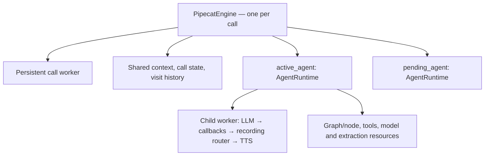

# Agent transfer with one call-owned engine

Status: design proposal; APIs below are proposed unless identified as upstream primitives.
Scope: in-call transfer between saved Dograh workflows; cascade STT/LLM/TTS only.

**One call → one `PipecatEngine` → one persistent conversation → replaceable `AgentRuntime`s.**
The engine owns orchestration, transfer, rollback, and call termination. An agent runtime
packages a workflow's execution state and resources beneath that engine. No additional
call orchestrator sits above the engine.

Sections 1–10 are the plan. Appendices A–C record what was verified against the pinned
sources, which apparent obstacles are not real, and which alternatives were rejected.

## 1. Ownership and invariants

| Owner | State/resources | Lifetime |
| --- | --- | --- |
| `PipecatEngine` | Call identity/org, shared `LLMContext`, call variables, gathered results, final disposition/tags, visit history, hold/transfer state, termination guard | Entire call |
| Engine-owned persistent worker | Transport input/output, audio buffer, canonical user/assistant aggregators, answer supervisor, termination funnel, call timer, transcript coordinator, metrics, call trace | Entire call |
| `AgentRuntime` | Visit ID, pinned workflow definition/graph, current node, resolved model configuration, LLM/TTS worker, inference/extraction clients, embeddings configuration, tool/MCP resources, generation state | One agent visit; retained temporarily for rollback |
| Engine-owned STT selection | Recognition services and turn-policy adapter; active selection comes from the agent runtime | Persistent routing; selected profile changes at handoff |
| Engine-owned integration collection | Call-level collectors plus workflow/visit-specific configuration and snapshots | Finalized at actual call completion |

Invariants:

- `engine.call_worker`, call ID, recorder, and shared context object retain identity.
- The engine alone authorizes agent activation, context replacement, and call completion.
- At most one agent may generate caller-facing speech; a pending agent remains gated.
- The call timer, recording, and hangup handling remain live during hold/preparation.
- Every asynchronous operation carries its originating visit; changing `active_agent`
  does not change the ownership of work already running.
- A failed destination is a transfer failure while the source remains usable.
- Agent deactivation/retirement never invokes the call's completion path.
- A → B → A creates three visit IDs, even if the first and third use the same definition.



## 2. Separate call execution from agent execution

`self.task` currently conflates speech routing, tracing, and termination. Replace its
uses by intent; never repoint it wholesale at a child worker.

| Operation | Target |
| --- | --- |
| End call / enforce maximum duration | Engine → coordinated shutdown → persistent `call_worker` |
| Resolve conversation/turn trace | Persistent call tracing context |
| Speak configured text | Selected runtime's `speak()` → its TTS → persistent output |
| Generate a response / register agent tools / configure prompt | Selected runtime's LLM |
| Play ringer or prerecorded audio | Persistent transport output |
| Drain/retire one agent | Selected runtime's child worker and resource lifetime |
| Mutate shared context, gathered results, active node/agent | Engine, subject to origin and lifecycle checks |

Rename as part of this: `PipecatEngine.set_task()`/`self.task` become `call_worker`.
`PipelineTask` is a deprecated alias of `PipelineWorker` upstream (`pipeline/worker.py:1715`);
leaving both the call worker and the agent worker called "task" is how §2 and §6 bugs get
written.

Proposed interfaces:

```python
class PipecatEngine:
    call_worker: PipelineWorker
    context: LLMContext
    active_agent: AgentRuntime
    pending_agent: AgentRuntime | None

    async def prepare_agent(self, target, *, origin_visit_id): ...
    async def transfer_to_agent(self, target, reason, *, origin_visit_id): ...
    async def set_node(self, node_id, *, origin_visit_id): ...
    async def queue_node_opening(self, *, origin_visit_id, opening_policy): ...
    async def end_call_with_reason(self, reason, abort_immediately=False): ...
    async def cleanup(self): ...


class AgentRuntime:
    visit_id: str
    definition_id: int
    workflow: WorkflowGraph
    current_node: Node | None
    worker: PipelineWorker
    llm: LLMService
    inference_llm: LLMService
    variable_extraction_llm: LLMService
    # Resolved STT/turn profile, embeddings, tools/MCP, generation state.

    async def speak(self, text, *, append_to_context=True): ...
    async def run_llm(self, context): ...
    async def drain(self): ...
    async def retire(self): ...
```

`AgentRuntime` implements execution/resource operations; tools and worker events delegate
decisions to the engine. Runtime retirement is local. In upstream, `LLMWorker.end()`
requests session termination; it is not the implementation of `retire()`.

## 3. Physical topology

```text
Persistent worker:
  input → termination funnel → STT selection → answer supervisor
    → user aggregator → answer gate → handoff inference gate → bus bridge
    → output → audio buffer → assistant aggregator → metrics
  + persistent timer, transcript/feedback observers, integration collection

Child worker for each agent visit:
  bridge input → LLM → generation callbacks → recording router → TTS → bridge output

Ringer / prerecorded greeting:
  engine → persistent output → recording / assistant aggregation as appropriate
```

Split `PipelineEngineCallbacksProcessor`: call-duration logic remains persistent;
generation/text callbacks carry their originating runtime. Parent callbacks for mute,
idle, and node policy consult the engine; delayed speech/transcript callbacks retain
their original visit attribution.

### Bridge frame routing (load-bearing)

The two bridge classes behave oppositely, and the persistent pipeline depends on the
difference:

| Class | Behavior | Where |
| --- | --- | --- |
| `BusBridgeProcessor` | **Consumes.** Publishes to the bus and does *not* push downstream locally | Mid-pipeline, persistent worker (`bus/bridge_processor.py:107-138`) |
| `_BusEdgeProcessor` | **Tees.** Pushes downstream locally *and* publishes | Pipeline edges of a `bridged=()` child (`:209-212`) |

Everything after the bridge in the persistent pipeline — output, audio buffer, assistant
aggregator, metrics — is downstream of a consuming processor. Left alone, caller
`InputAudioRawFrame`s die at the bridge and **recording breaks for the whole call**, not
only during hold.

Fix with the built-in escape hatch rather than a custom passthrough: both classes accept
`exclude_frames=`, which routes named types locally instead of across the bus
(`bridge_processor.py:128-131`). STT is persistent, so a child never needs raw caller
audio:

```python
BusBridgeProcessor(..., exclude_frames=(InputAudioRawFrame, ...))
```

Audit the exclusion list against every processor sitting downstream of the bridge. Keep
caller PCM flowing to the recorder during hold and any interval with no active child,
without duplicating audio returned by a child. Forward playback, interruption, and
required control frames to the appropriate worker. Keep valid usage events from retired
visits even when their late speech output is rejected.

## 4. Agent preparation

Resolve targets through organization-scoped DB clients and an allowed destination list.
**The allowlist is mandatory, not an optimization** — see §7: STT profiles live in a
persistent `ServiceSwitcher` whose members are fixed at construction
(`pipeline/service_switcher.py:279`), so a destination absent from the list cannot be
transferred to at all in the POC. LLM/TTS children are still built lazily.

Pin the destination's definition through the same selection policy a fresh call to it
would use (`run_creation.definition_to_run`), and resolve model overrides from that
definition. The policy takes its `use_draft` from the call rather than from the
destination. Only the entry point knows what kind of call this is -- an agent test runs
drafts, a campaign runs published -- and the agents a call transfers to are discovered
mid-call, long after that entry point is gone, so the decision is recorded on the run
(`workflow_runs.extra.use_draft`) rather than re-derived in the pipeline. It lives in
`extra` rather than `initial_context` because that column is run-owned: everything
outside `RESERVED_INITIAL_CONTEXT_KEYS` is caller-writable, so a public-API caller could
otherwise opt a production call into unpublished drafts. Splitting that -- the first agent on a draft, the second on
whatever was last published -- reads as a bug in the destination agent, because nothing
the author or the caller can see says a different version answered. Validate cascade
mode and supported STT configuration before entering the handoff.

Construct a fresh runtime, including its inference clients, extraction rules, embeddings,
tools/MCP, and graph state. Preparing B must not overwrite A's live context/tools or
trigger B's Start-node response. Call-level state remains on the engine; definition-level
settings become B's runtime configuration. Merge allowed variables/template defaults
deliberately; the initial call's `greeting_override` does not automatically apply to B.

Attach B with `call_worker.add_workers(B.worker)`: children inherit parent lifecycle;
independent roots can keep the runner alive. Wait for worker readiness and provider
usability explicitly. Registration, `add_workers()` completion, and an activation message
being sent are not equivalent to a usable, fully activated agent — activation additionally
requires the worker to have started (`workers/base_worker.py:1274`).

### Do not inherit `LLMWorker` tool publication

`LLMWorker.on_activated` pushes `LLMSetToolsFrame(build_tools())`
(`workers/llm/llm_worker.py:156-160`), and the aggregator treats that frame as a
**replacement** of the advertised tool set, not a merge
(`processors/aggregators/llm_response_universal.py:127-133`). Activating B would therefore
clobber the tools the engine composed from B's current node. Two outs:

- Build the child as a plain `PipelineWorker` and keep engine-driven
  `llm.register_function` / `context.set_tools` as the only tool path. **Preferred** —
  dograh composes tools per node, so worker-level `@tool` publication has nothing to add.
- If `LLMWorker` is used for its handoff helpers, override `build_tools()` to return `[]`.

MCP resource lifetimes must close in the task that opened them. The engine owns those
lifetimes through managed tasks/contexts; arbitrary transfer callbacks cannot close
task-affine sessions.

## 5. Transfer transaction

Call state: `RUNNING → ENDING → ENDED`. Handoff state while running:
`IDLE → ANNOUNCING → HOLD/PREPARING → COMMITTING → OPENING → IDLE`.

1. **Accept:** capture source runtime A and request/visit IDs; validate destination;
   serialize transfer requests. Register the tool as a workflow-control boundary.
2. **Settle tool:** return its result with `FunctionCallResultProperties(run_llm=False)`;
   await context commitment and settle sibling control work. Continue from an
   engine-owned task, outside A's tool cleanup lifetime.

   Upstream solves this for decorated tools: `LLMWorker.queue_frame` defers any frame
   queued from inside a `@tool` handler until every in-flight tool settles, keyed on an
   `_IN_TOOL_CALL` contextvar (`workers/llm/llm_worker.py:170-190`). Because it keys on
   the *handler's* context, it cannot cover dograh's direct `llm.register_function`
   registrations. Treat that implementation as the reference semantics to reproduce
   rather than designing the ordering from scratch.
3. **Announce:** speak on A's TTS; wait for playback and transcript commitment. Drain
   A's response and pause background context writers before taking the handoff snapshot.
4. **Hold:** gate ordinary inference/idle prompts; start persistent ringer. Keep caller
   recording/recognition, call deadline, termination, and control processing live.
5. **Prepare concurrently:** await B's readiness and await snapshot compaction. Keep A
   available until commit. Bound preparation time and retain caller messages arriving
   after the snapshot boundary.
6. **Commit under the gate:** recheck that the call is running and the request is still
   current; install compacted history plus its new-message tail, destination STT/turn
   policy, active runtime, prompt/tools, and visit metadata. Activate B without automatic
   inference (`run_llm=False`); await its activation acknowledgment. The parent remains
   active. Complete or roll back partially applied configuration before releasing gates.
7. **Open:** stop/drain ringer audio; execute one explicit opening policy using B's
   runtime; release normal inference/input processing in the defined order.
8. **Retire:** drain A's remaining events and release its worker/resources locally.
   Record successful transfer only after activation has succeeded.

Use an engine-owned transfer task plus a short commit lock; do not hold a global lock
across provider requests or summarization. Hangup/deadline sets `ENDING`, invalidates
the request and cancels preparation. No later callback may reactivate an agent. Before
successful commit, failure restores A and its uncompressed context plus new messages;
after successful handoff, recovery is a new engine decision, not silent state reversal.

## 6. Context and asynchronous ownership

Keep the `LLMContext` object; replace its message contents only at the controlled commit.
Keep the complete transcript outside model-context compaction.

```text
destination messages = summary(history through N)
                     + retained recent turns / exact identifiers
                     + caller messages committed after N
destination instructions/tools = destination definition and current node
structured call variables = explicit carry-forward policy
```

Compaction must be an awaitable snapshot operation returning prepared messages.
`ContextSummarizationManager.start()` is unusable as a handoff barrier on two counts
(`services/workflow/pipecat_engine_context_summarizer.py:43-57`): it schedules a
fire-and-forget background mutation of the live context, **and** it cancels any in-flight
summarization on entry — so B's `set_node` would kill a transfer compaction still running.
A snapshot API must return messages rather than mutate, and must not share cancellation
with node-transition summarization. On timeout, use bounded recent history and structured
facts. Treat history as conversation data, separate from B's instructions.

Capture runtime references before awaits:

```python
agent = self.active_agent
result = await agent.variable_extraction_llm.run_inference(context_snapshot)
self.record_extraction(agent.visit_id, result)  # Engine decides merge policy.
```

Compatibility getters such as `engine.llm → active_agent.llm` may ease migration but
cannot supply async ownership. Tag tool results, extraction, summarization, generation,
and transcript events with visit/operation IDs. Retain valid late facts and usage;
reject stale node changes, context replacement, and speech. A helper must not read A's
client before an await and B's client/configuration afterward.

## 7. STT, hold audio, and opening policy

- **STT:** preserve destination STT configuration as a requirement. For the POC, prepare
  distinct STT profiles for allowlisted destinations in a persistent `ServiceSwitcher`;
  construct LLM/TTS children lazily. Switcher membership is fixed at construction, which
  is what makes the §4 allowlist mandatory. Reject unsupported profiles explicitly.
  Arbitrary STT services discovered mid-call require a later recognition-worker/slot
  extension.
- **Turn policy:** switch STT and aggregator turn strategies together behind a focused
  adapter. Dograh passes explicit strategies, suppressing upstream metadata-based
  adaptation (`processors/aggregators/llm_response_universal.py:1032`). Propose a
  supported aggregator update API upstream; do not scatter private controller access
  (`turns/user_turn_controller.py:169`). Persistent context does not require fixed STT.
- **Caller speech on hold:** keep A's recognition temporarily with inference gated;
  retain the transcript tail. Switch at an utterance boundary and use a bounded audio
  buffer for speech crossing that boundary. Avoid duplicate transcription on replay.
- **Ringer:** queue small paced chunks directly to output; provide bounded stop/drain.
  `play_audio_loop()` queues the entire clip as one `OutputAudioRawFrame` and then waits
  `duration + 1.5` (`services/pipecat/audio_playback.py:185-194`), so setting its stop
  event ends the loop but leaves up to a full clip of ring already queued in the output
  transport. Include hold audio in recording, exclude it from textual context, and
  distinguish it from agent speech for timing/attribution.
- **Opening:** `configured`, `continue`, or `silent`; choose once per activation.
  Suppress both tool-result and activation-triggered inference. Text uses B's TTS;
  recorded greetings carry their transcript into context. Reuse greeting policy logic
  through explicit runtime routing. Worker-level tool publication must not overwrite B's
  workflow tools (§4).
- **Entry vs connection:** entering B's Start node does not rerun answer supervision,
  recording startup, connection readiness, or pre-call fetch implicitly.

## 8. Accounting, tracing, and termination

One workflow-run row remains the call anchor for the POC. Preserve its originating
workflow identity and append visits containing workflow/definition IDs, resolved models,
entry/exit times and transfer outcome. Final disposition is engine-owned; preserve
per-visit outcomes/rules separately instead of allowing a runtime to finalize the call.

Maintain one canonical turn tracker. A turn may contain multiple assistant utterances
from different visits — A's announcement and B's greeting can fall inside one logical
turn — and `_TurnTranscriptState` holds a single assistant record
(`services/pipecat/transcript_log_coordinator.py:48`), so transcript state must be
extended beyond one assistant record per turn. Capture provenance at origin, not by
reading `active_agent` when an event arrives. Aggregate usage across workers,
deduplicate it, and attribute it by visit/service/model.

Child workers need explicit call audio parameters, tracing-parent propagation and event
collection. A parent observer does not see all child-internal events. Keep one call trace
with visit/handoff spans; avoid resetting call collectors on child lifecycle frames.
Integration sessions need visit-aware model/version metadata and snapshots. Executing
destination integrations after the call also requires completion dispatch over visited
pinned definitions; the current dispatcher reads only `workflow_run.definition.workflow_json`
(`tasks/run_integrations.py:219-221`), so B's completion handlers never fire today.

### Terminal frames do not reach children

All end-call tools, deadlines, disconnects and unrecoverable errors enter
`engine.end_call_with_reason()`. It invalidates transfers, settles final state, and
coordinates child shutdown before call snapshots/completion.

The existing path ends at `await self.task.queue_frame(EndFrame/CancelFrame)`
(`services/workflow/pipecat_engine.py:1156`). That frame drains the parent pipeline only.
Child propagation runs in `_handle_worker_end`/`_handle_worker_cancel`
(`pipeline/worker.py:1374-1396`), which are reached by a bus message, never by a frame on
the parent's push queue. Orphaned children are eventually cancelled at runner shutdown
(`workers/runner.py:398`), but that is a cancel, not a drain: the child's final audio and
metrics are cut.

Replace with the worker-level calls, which already drain then send the bus message:

| Today | Replacement |
| --- | --- |
| `task.queue_frame(EndFrame(reason))` | `call_worker.end(reason=...)` (`pipeline/worker.py:799-808`) |
| `task.queue_frame(CancelFrame(reason))` | `call_worker.cancel(reason=...)` |

Then drain producers/observers, flush final recording/transcripts, finalize integration
snapshots, persist/upload artifacts, and enqueue completion once. Preserve recording flush
before Noveum finalization. Route candidate failures to transfer recovery; retain the
parent termination funnel for actual call-ending conditions.

## 9. Refactor and validation sequence

1. Extract `AgentRuntime` while running one agent; retain existing behavior. Move
   graph/node, model clients/configuration, tool resources and generation state together.
2. Replace ambiguous `task` access with `call_worker` or runtime execution methods;
   keep engine initialization, context ownership and finalization call-scoped.
3. Make helper APIs and callbacks carry originating runtime/visit IDs. Split persistent
   timer from generation callbacks; preserve asynchronous event attribution.
4. Integrate child response workers and engine-managed resource lifetimes. Verify
   dynamic readiness, audio rates, metrics/tracing, local retirement and parent shutdown.
   Land the bridge exclusion list (§3) with a recording assertion before anything else
   crosses the bus.
5. Add engine-owned handoff, snapshot compaction, hold audio, controlled opening and
   rollback; then coordinated STT/turn-policy switching and visit-aware integrations.

Acceptance: A → B → A across different cascade profiles; unchanged connection/context
identity and continuous recording; correct tools/voice/turn policy; one greeting per
activation; caller speech during hold preserved once; pending/late tool and transcript
events attributed correctly; unavailable B resumes A; hangup during every preparation
phase prevents activation; A retirement leaves the call live; final usage includes all
visits and completion runs once. Validate with frame/lifecycle tests and live calls.

## 10. Source seams

- [Engine and helper managers](services/workflow/pipecat_engine.py): ownership split,
  node transitions, greeting routing, extraction and finalization.
- [Pipeline construction](services/pipecat/pipeline_builder.py),
  [runtime assembly](services/pipecat/run_pipeline.py),
  [runner wrapper](services/pipecat/worker_runner.py),
  [event handlers](services/pipecat/event_handlers.py): persistent/child wiring and shutdown.
- [Generation/timer callbacks](services/pipecat/pipeline_engine_callbacks_processor.py),
  [audio playback](services/pipecat/audio_playback.py),
  [context summarizer](services/workflow/pipecat_engine_context_summarizer.py),
  [transcript coordinator](services/pipecat/transcript_log_coordinator.py).
- [Integration contract](services/integrations/base.py),
  [completion dispatch](tasks/run_integrations.py): visit-aware collection and dispatch.
- Upstream pinned sources: [LLM worker](../pipecat/src/pipecat/workers/llm/llm_worker.py),
  [child lifecycle](../pipecat/src/pipecat/workers/base_worker.py),
  [pipeline lifecycle/drain](../pipecat/src/pipecat/pipeline/worker.py),
  [bus bridge](../pipecat/src/pipecat/bus/bridge_processor.py),
  [service switcher](../pipecat/src/pipecat/pipeline/service_switcher.py),
  [per-agent TTS example](../pipecat/examples/multi-worker/local-handoff/local-handoff-two-agents-tts.py).

---

## Appendix A — Verified against pinned sources

Checked against the pinned `pipecat` submodule and the current worktree. Line numbers
drift when the submodule is bumped; re-verify before relying on them.

| Claim | Verdict | Evidence |
| --- | --- | --- |
| `play_audio_loop()` queues a full clip; the stop event does not remove queued audio | Confirmed | `services/pipecat/audio_playback.py:185-194` |
| `ContextSummarizationManager.start()` is a background mutation, not a barrier | Confirmed, and it also cancels any in-flight summarization on entry | `services/workflow/pipecat_engine_context_summarizer.py:43-57` |
| Queueing a terminal frame on the parent does not reach children | Confirmed | `services/workflow/pipecat_engine.py:1156` vs `pipeline/worker.py:1374-1396` |
| Worker tool publication can overwrite the node's workflow tools | Confirmed; `LLMSetToolsFrame` replaces rather than merges | `workers/llm/llm_worker.py:156-160`, `processors/aggregators/llm_response_universal.py:127-133` |
| Completion dispatch reads only the original run definition | Confirmed | `tasks/run_integrations.py:219-221` |
| Transcript state assumes one assistant record per turn | Confirmed | `services/pipecat/transcript_log_coordinator.py:48` |
| `add_workers()` completion ≠ an activated agent | Confirmed; activation also requires the worker to have started | `workers/base_worker.py:1274-1281` |
| `BusBridgeProcessor` consumes local frames; `_BusEdgeProcessor` tees | Confirmed; both accept `exclude_frames=` | `bus/bridge_processor.py:107-138`, `:128-131`, `:209-212` |
| Aggregator turn strategies are frozen at construction and suppress upstream adaptation | Confirmed | `services/pipecat/run_pipeline.py:988-1019`, `processors/aggregators/llm_response_universal.py:1032` |
| Upstream defers frames queued inside a `@tool` handler | Confirmed; keyed on the handler's context, so direct registrations are not covered | `workers/llm/llm_worker.py:170-190` |

## Appendix B — Not constraints

Assumed by the plan above; recorded so they are not re-litigated as blockers.

- **`FrameProcessorSetup` is reconstructible at runtime.** Clock, task manager, observer,
  tracing context and sample rates all live on the worker
  (`pipeline/worker.py:1324-1341`); any live processor exposes its copy via
  `self.processor_setup` (`processors/frame_processor.py:402`).
- **`link()` is two pointer assignments** (`processors/frame_processor.py:671`). Pipeline
  topology is frozen by convention, not by mechanism.
- **A processor goes live via `setup()` then a `StartFrame`** — the input task is created
  on the `StartFrame` (`:727-728`), the process task in `__start` (`:1093`).
- **`WorkerRunner.add_workers()` is supported on a running runner**
  (`workers/runner.py:200-236`, dispatch at `:372-373`), and
  `BaseWorker.add_workers()` registers children whose lifecycle follows the parent
  (`workers/base_worker.py:648`, `:1363-1369`).
- **Draining is solved**: `worker.flush_pipeline()` / `PipelineFlushFrame`
  (`pipeline/worker.py:949`, `frames/frames.py:2046`).
- **Per-model usage separates cleanly**: metrics are keyed `processor|||model`
  (`services/pipecat/pipeline_metrics_aggregator.py:74`) — provided child `MetricsFrame`s
  cross the bridge (§3).

## Appendix C — Rejected alternatives

| Alternative | Why not |
| --- | --- |
| Rebuild the whole pipeline mid-call, keeping the transport | `transport.input()/output()` are singletons created in the transport's `__init__` (e.g. `transports/websocket/fastapi.py:698-712`); a second `setup()` double-subscribes them. |
| Hot-swap processors inside a live `Pipeline` (a slot owning a swappable child chain) | Technically possible given Appendix B, but it hand-rolls worker lifecycle inside a processor and duplicates what `activate_worker(deactivate_self=True)` already does and upstream maintains. |
| Pre-built `ServiceSwitcher` per agent for the full cascade | Requires declaring every destination before the call and holds N live provider connections for its duration. Retained for STT only (§7), where fixed membership is acceptable. |
| Settings-delta swap on one shared cascade (`LLMSettings`/`TTSSettings` updates) | Cannot change provider or credentials, and gives no isolation between visits for usage, tracing or failure. Viable only when every destination shares one provider set. |
| Distributed bus (`RedisBus` / `PgmqBus`) | Same tool surface, so not a fork in the road — adopt later if agents must be independently deployable. |
| Realtime (speech-to-speech) destinations | `build_realtime_pipeline` has no STT/TTS stages at all, so realtime↔cascade transfer is a pipeline shape change, not a runtime swap. Out of scope; reject mixed-modality targets explicitly. |

## Appendix D — What is built

Sections 1–8 are implemented for cascade agents; §9's sequence was collapsed
into one change rather than five landings. Everything below is covered by
`api/tests/test_agent_transfer.py`, which runs the real split pipeline against
pipecat's worker runner and bus.

| Plan | Where it landed |
| --- | --- |
| `AgentRuntime` (§1, §2) | [agent_runtime.py](services/workflow/agent_runtime.py). `engine.llm`, `inference_llm`, `variable_extraction_llm`, `workflow` and `_current_node` became properties reading through to `active_agent`, so every helper, tool and manager kept working unchanged. |
| `call_worker` rename (§2) | `set_call_worker()`; `task` stays as a deprecated alias property. |
| Split topology (§3) | `build_pipeline(agent_generation_segment=…)` + `build_agent_generation_pipeline()` + `create_agent_worker()`. The child is exactly the segment the single-worker pipeline puts between the user aggregator and the output transport. |
| Bridge routing (§3) | [agent_bridge.py](services/pipecat/agent_bridge.py). Three groups: frames kept local (caller audio, the worker's own heartbeat, worker-control frames), frames teed by `AgentBusTeeProcessor` so both sides see them exactly once (speaking and interruption), and everything else, which crosses. `assert_caller_audio_stays_local()` runs at call setup. |
| Visit tracing (§8) | Agent workers run with `enable_tracing=True` and share the call worker's `TracingContext` instead of building one. Both halves are needed: the flag reaches the services as `_tracing_enabled`, which `@traced_llm`/`@traced_tts` check before they look at any context, and the shared context is what parents a visit's spans into the call's turns. A worker only builds a context of its own when it also tracks turns, which a child must not do. Miss either half and every agent's LLM and TTS run untraced, which shows up as a trace whose turns are empty rather than as anything obviously missing. |
| Lazy preparation, mandatory allowlist (§4) | [agent_runtime_factory.py](services/pipecat/agent_runtime_factory.py). One tool, one destination: the allowlist is the set of transfer tools on the node, resolved org-scoped through `db_client.get_workflow(..., organization_id=…)`. |
| No `LLMWorker` tool publication (§4) | Agent workers are plain `PipelineWorker`s; tools stay engine-composed per node. |
| Transfer transaction (§5) | [agent_transfer.py](services/workflow/agent_transfer.py). The tool returns `run_llm=False` and starts an engine-owned task from `on_context_updated` — the aggregator cancels those callbacks on interruption, so the handoff must not *be* one. |
| Snapshot compaction (§6) | [agent_handoff_context.py](services/workflow/agent_handoff_context.py) — awaitable, returns messages, never mutates, does not share cancellation with node-transition summarization. Tool traffic is dropped; caller turns after the boundary are appended at commit. |
| Origin-tagged async work (§6) | `set_node`, `queue_node_opening` and the generation callbacks all take `origin_visit_id` and reject work from a retired visit. |
| Hold audio, opening (§7) | `play_hold_audio_loop()` paces the clip in chunks so stopping is bounded. The destination always opens with its own start node, so exactly one opening runs per activation. |
| Terminal frames reaching children (§8) | `end_call_with_reason` invalidates any handoff, then drains (or, on abort, cancels) every agent worker before queueing the call's terminal frame. |
| Authoring | `transfer_agent` tool type: pick the destination agent and the handover line. The create dialog collects the destination, because a transfer tool with nowhere to go is not a valid tool. |
| Visit accounting (§8) | `gathered_context["agent_visits"]` and `["agent_transfers"]`; usage crosses the bridge and lands in the one call-scoped metrics aggregator. |

§7's `configured` / `continue` / `silent` opening policy, per-destination
handover messages, a hold-audio toggle and a success tag were all designed and
then cut before shipping: none had a caller today, and each was a fork in the
runtime to keep working. What is left is one destination per tool and one
configurable line. An agent that can route several ways gets several transfer
tools, and chooses between them by their names and descriptions — the same
thing it already does for every other tool, rather than a second routing
mechanism inside one.

Inference is gated during a handoff by deactivating the source agent rather
than by muting the caller: an inactive worker is handed no frames from the
bus, so recognition and recording keep running and what the caller says on
hold is carried across at commit.

Two departures from the plan as written, both verified against the pinned
sources:

- §8's replacement table says to call `call_worker.end(reason=…)`. That is a
  *runner-wide* end (`BaseWorker.end` sends `BusEndMessage`), and the runner
  answers it by cancelling workers that are still winding down. The engine
  ends its children explicitly and then queues the terminal frame, which
  reaches the same goal — children drained, not cut — without that race.
- §3's exclusion list needed more than caller audio. A first live call turned
  up two frames the plan had not accounted for, both addressed to the call
  worker itself rather than to a peer: its own `HeartbeatFrame`, which the
  worker watches for at its sink, and `CancelWorkerFrame`, which the output
  transport pushes upstream when audio writes keep failing and the termination
  funnel catches upstream of the bridge. Handed to the bus, the first logged a
  spurious heartbeat timeout on every hold and the second would have left a
  call with a dead audio path running.
- §8 also notes that agent errors would reach the call's termination funnel.
  They are kept out of it on purpose: a destination failing while it is being
  prepared under a ringer is a failed transfer, not a failed call, so the
  engine decides from each agent worker's own `on_pipeline_error`.

### Not built

- **Per-agent STT and turn policy (§7).** Recognition stays on the call's
  configuration for the whole call, so a destination with a different STT
  model or language is transcribed with the source's. This is the largest
  remaining gap and needs the persistent `ServiceSwitcher` §7 describes.
- **Visit-aware integrations and completion dispatch (§8).** Completion still
  reads only `workflow_run.definition.workflow_json`, so a destination
  agent's completion handlers do not fire.
- **Transcript state for several assistant utterances in one turn (§8).**
  A source agent's announcement and a destination's greeting inside one
  logical turn still collapse to one assistant record.
- **Realtime destinations.** Rejected explicitly at build time
  (`destination_is_realtime`), per Appendix C.
