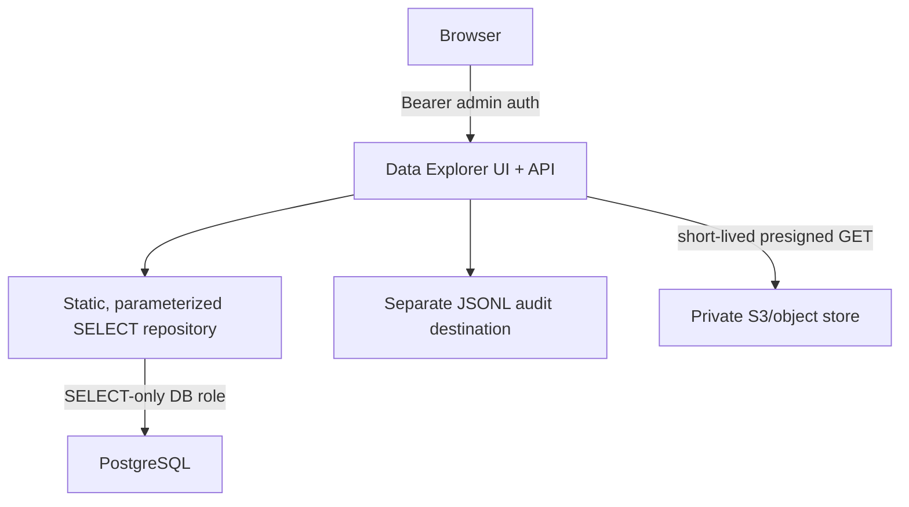

# CALMOS Data Explorer architecture

`apps/data-explorer` is a standalone FastAPI service named **CALMOS DATA
EXPLORER**, version 1.0.0. Its browser UI and API are same-origin; browsers
never connect to PostgreSQL or receive AWS credentials.



The repository accepts only bounded query-builder fields (call/run/caller/date,
agent, status and event severity). It has no SQL-console or generic query
method. It also starts every repository transaction with `SET TRANSACTION READ
ONLY`; the deployment role remains the controlling safeguard.

The stable call export envelope is:

```json
{
  "schema_version": "1.0",
  "call": {},
  "agent_run": {},
  "caller": {},
  "transcript": "",
  "conversation": [],
  "scores": {},
  "safety": {},
  "clinical_evaluation": {},
  "memory": {
    "available_before_call": [],
    "retrieved_for_call": [],
    "written_during_call": [],
    "current": [],
    "history": []
  },
  "files": []
}
```

The memory provenance trail never invents retrieval evidence: a fact is marked
available-before from its timestamp, written-during from
`source_agent_run_id`, and historically sourced from `memory_sources`.
