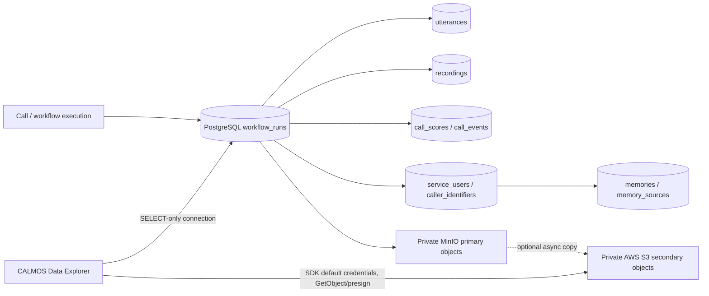

# CALMOS Data Explorer storage audit

This audit is based on the checked-out Dograh implementation, including CALMOS
Connect v1.46.0.3 migration `4f1c2d3e5a67_add_durable_call_and_memory_storage`
and the later compatible primary/secondary artifact work. It is an inspection
record, not a proposed replacement schema.

## Discovered implementation

| Concern | Actual implementation |
| --- | --- |
| Database engine/location | PostgreSQL through SQLAlchemy async engine (`DATABASE_URL` in `api/constants.py`; engine in `api/db/base_client.py`). No SQLite/local-file datastore is used. |
| ORM/migrations | SQLAlchemy models in `api/db/models.py`; Alembic migrations in `api/alembic/versions/`. Durable tables originate in `4f1c2d3e5a67`. |
| Calls and agent runs | `workflow_runs`; canonical call key is unique `workflow_runs.call_id`. There is no `agent_runs` table. `workflow_runs.id` is the agent-run ID. |
| Call metadata | `workflow_runs` holds lifecycle, provider/model/STT/TTS, caller references, transcript text, artifact keys, latency/debug/usage/cost JSON, workflow relation, and storage backend. |
| Messages/transcript | Immutable speaker-labelled `utterances` rows (`agent_run_id`, sequence, timing, transcript, optional turn scores). Complete transcript is `workflow_runs.full_transcript`; optional transcript object key is `transcript_object_key`. |
| Caller identity | `service_users` is the stable organization-scoped person key. `caller_identifiers` stores HMAC-SHA256 lookup values, not raw values. A call can retain provider caller values in `workflow_runs.caller_identifier` and `telephone_number`. |
| User memory | PostgreSQL `memories` with `source_agent_run_id`, `source_utterance_id`, vector(1536), confidence/relevance/privacy metadata; `memory_sources` provides additional call/utterance provenance. `privacy_permissions` is append-only consent provenance. |
| Memory retrieval | The memory client performs vector similarity retrieval at runtime, but no per-call “memory retrieved” event/table is persisted. Retrieval provenance therefore cannot be reconstructed safely. |
| Scores/safety/clinical | `call_scores` contains JSON CALM, safety and clinical evaluation outputs; `call_events` stores timestamped severity/payload events. |
| Audio/files | `recordings` stores one row per run/track (`mixed`, `user`, `bot`) with backend, object key, format, duration, size and SHA-256. The schema has no generic call-files table. |
| Primary object store | Current deployment defaults to private MinIO. Object keys use `recordings/{YYYY}/{MM}/{service_user_id}/{call_id}/{track}.wav` and `transcripts/{YYYY}/{MM}/{service_user_id}/{call_id}/transcript.txt`. |
| AWS/S3 | `S3FileSystem` uses `aioboto3.Session()` and therefore the SDK default credential provider chain. Current Stage C copies confirmed MinIO primary artifacts asynchronously to private S3 when `ENABLE_AWS_S3_SECONDARY=true`; `artifact_replication_status` records the destination bucket/key/status. `AWS_S3_PREFIX` is prepended only to secondary keys. |
| Existing APIs/auth | Dograh mounts routes under `/api/v1`; `call-history/{call_id}/replay` authenticates with `get_user`, organization-scopes the run, and generates 60–900 second URLs. Authentication supports local JWT or Stack Auth/API key. |
| Docker | Dograh’s API and worker run under existing Compose. MinIO is primary. The Explorer is added as an independent Compose file/service, not folded into production API Compose. |

## Relevant durable tables and indexes

`workflow_runs` indexes include unique `call_id`, workflow/campaign/service-user,
started/end/created timestamps, state/status/direction and provider call ID.
`utterances` has unique `(agent_run_id, sequence_number)` and run index.
`recordings` has unique `(agent_run_id, track)`, run/key/created indexes.
`call_scores` is unique per run. `call_events` indexes run and type/time.
`memories` indexes service user, source run/utterance, active/type, expiry, and
an IVFFlat pgvector cosine index. `memory_sources` indexes memory and run.
The built-in `/api/schema` page reports the live compatible table/column,
foreign-key and index metadata without showing credentials.

## Deliberate adapter boundaries

The Explorer consumes the tables above and does not add tables, triggers, or
write paths to the Dograh datastore. “Memory retrieved during this call” is
shown as unavailable until a future durable retrieval-event contract exists.
For a MinIO-only deployment, object download requires an Explorer object-store
adapter configured for that private endpoint; production AWS designs use the
S3 adapter and SDK role credentials. Neither case requires a public bucket.
