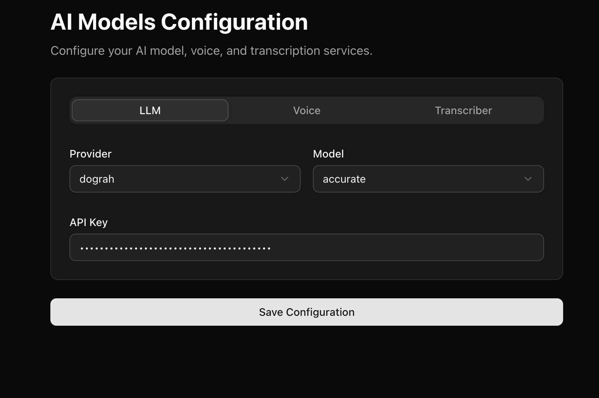

## Configure Models
Zoren Voice Platform ships with its own models by default. When you sign up on https://zoren-voice.ashtra.ai or you setup the platform on your self hosted infrastructure, you get some Zoren Voice model credits by default.

If you wish to change the models to a provider of your own choice, ou can go to `https://zoren-voice.ashtra.ai/model-configurations` if you are on hosted version of Zoren Voice or go to `http://localhost:3010/model-configurations` if you are running Zoren Voice locally.

You can see the configuration for the inference provider in the following screenshot.

You can select the provider from the dropdown and configure the API key, model, etc. For Zoren Voice, you can see [Service Keys](api-keys) documentation for instructions on how to create Service Keys to be used in Model Configuration.

Next there are some in depth documentation of various AI Models that you can configure.
