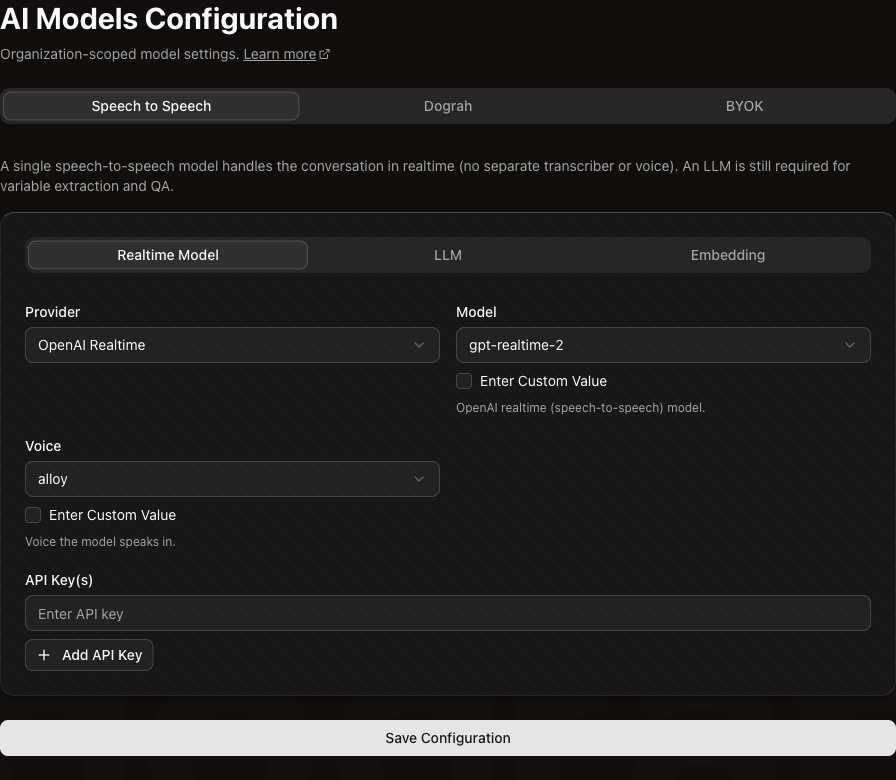
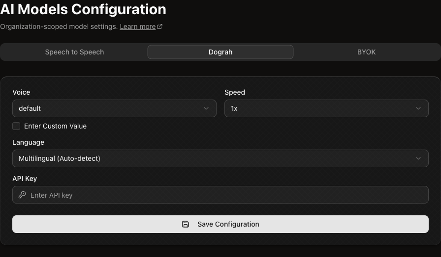
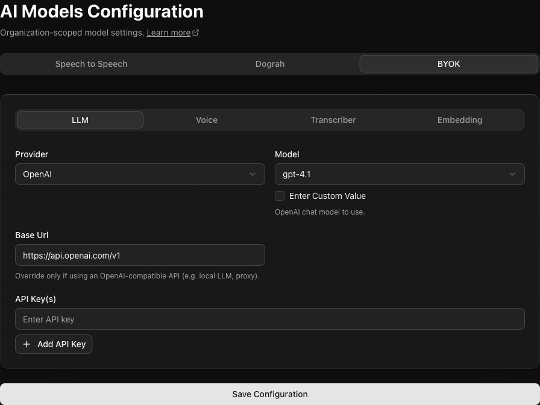

## How model configurations work

Model Configurations define the default AI model setup for your organization. Agents use this configuration unless you set agent-level model overrides in the agent settings.

To configure models, open **Models** in your Dograh dashboard:

- **Hosted:** `https://app.dograh.com/model-configurations`
- **Self-hosted:** `http://localhost:3010/model-configurations`
- **Local development:** `http://localhost:3000/model-configurations`

The Models page has three top-level sections:

| Section | When to use it |
|---------|----------------|
| **Speech to Speech** | Use a realtime speech-to-speech model for the live conversation. API providers need an LLM alongside it for variable extraction and QA; the experimental subscription provider uses its subscription reasoning model. |
| **Dograh** | Use Dograh-managed LLM, voice, and transcriber models behind one Dograh Service Key. |
| **BYOK** | Bring your own provider keys and configure LLM, Voice, Transcriber, and Embedding models separately. |

<Note>
Model settings are organization-scoped. If no agent-level override is set, every agent in the organization uses the saved global configuration.
</Note>

## Speech to Speech

Use **Speech to Speech** when you want a realtime model to handle the live spoken conversation directly. In this mode, the realtime model handles speech input and speech output, so you do not configure separate Voice and Transcriber services.



The Speech to Speech section has nested tabs:

| Tab | What to configure |
|-----|-------------------|
| **Realtime Model** | The speech-to-speech provider, model, voice, and authentication settings. |
| **LLM** | A standard LLM for non-realtime tasks with API providers. Hidden for the subscription provider. |
| **Embedding** | An embedding model used by features that need embeddings, such as retrieval from knowledge base content. |

<Warning>
API-backed Speech to Speech providers require a separate LLM for analysis outside the live audio stream. OpenAI GPT-Live (ChatGPT subscription) uses its subscription reasoning model for these tasks and does not require the LLM tab or a developer API key.
</Warning>

### Experimental ChatGPT subscription voice (self-hosted)

**OpenAI GPT-Live (ChatGPT subscription)** uses one connected Codex login for voice (`gpt-live-1-codex`, voice `cove`) and workflow reasoning (`gpt-5.6-luna` by default). No developer API key or separate LLM configuration is required. Dograh retains its existing workflow tool handlers and node transitions. Variable extraction, dispositions, and QA that reuse the workflow LLM use subscription reasoning too. Explicitly selected embeddings, a separately configured QA provider, and telephony can still have their own credentials and charges.

This is an opt-in ChatGPT backend compatibility integration, disabled by default. It does not establish an official OpenAI production API contract, universal account access, unlimited use, or upstream acceptance. A local credentials check is not proof of voice entitlement. Use a disposable self-hosted environment and a synthetic browser workflow before considering other workloads.

#### Use your existing Codex login

Prerequisites: an API and UI built from the experimental source, the pinned Pipecat dependencies, working Redis, the numeric ID of your test Dograh organization, Codex CLI, and an account able to access the subscription voice backend. Do not reuse a production database, object-storage bucket, Redis instance, or the ports/containers of another installation. Follow [contributor setup](/contribution/setup) for the application dependencies.

If Codex is already signed in with ChatGPT on the same host, no second login is needed. Enable reuse in the API environment and bind it to your test organization:

```dotenv
DOGRAH_OPENAI_SUBSCRIPTION_ENABLED=true
DOGRAH_OPENAI_SUBSCRIPTION_USE_CODEX_LOGIN=true
DOGRAH_OPENAI_SUBSCRIPTION_ORGANIZATION_ID=123
# Optional when the API service uses a different OS home:
# DOGRAH_OPENAI_SUBSCRIPTION_CODEX_HOME=/absolute/path/to/your/.codex
```

Dograh resolves the explicit subscription `CODEX_HOME` setting, then the API process's `CODEX_HOME`, then its OS user's `.codex` directory. It reads the existing ChatGPT `auth.json` before requests; it does not copy credentials, rotate tokens, or write to that login. Codex remains responsible for refreshing its own login. If the access token expires, the adapter reports **Refresh required** and accepts the new token on a later request after Codex refreshes it. There is no API-key fallback. A keyring-only login must be made available through Codex's supported file storage before this adapter can read it.

Skip the optional enrollment below and continue at **Select subscription models**. The API process must have read access to the existing file. Organization/account binding and the single voice-session lease still apply.

#### Optional: a separate Dograh login

Use a separate login when you want Dograh to own token refresh, such as a server running under a different service account. Set `DOGRAH_OPENAI_SUBSCRIPTION_USE_CODEX_LOGIN=false` (the default) for this mode.

1. Create a new credential directory outside the repository, accessible only to its owner and the Dograh service account. Do not copy your desktop `auth.json`, mount your entire `.codex` directory, or reuse the login directory of another app.
2. In an operator terminal, log in with Codex using that directory and file storage. For example, on macOS/Linux, replace the absolute path below with the new directory:

```bash
CODEX_HOME=/absolute/path/dograh-subscription-login codex -c 'cli_auth_credentials_store="file"' login
```

On Windows, use a new Command Prompt for this login only (replace the example path), then close that prompt before starting Dograh:

```batch
set "CODEX_HOME=C:\dograh-subscription-login"
codex -c cli_auth_credentials_store=file login
```

The operator completes the browser login. [Codex credential storage](https://learn.chatgpt.com/docs/auth#credential-storage) documents `file` as `auth.json` inside `CODEX_HOME`; OS keyring-only storage cannot be read by this adapter. Managed authentication settings may prohibit file storage. Do not display the resulting file, paste tokens into Dograh, or run Codex tasks from this directory.

3. Configure the API environment. Use the directory's absolute path as seen **by the API process** and your test organization's actual ID:

```dotenv
DOGRAH_OPENAI_SUBSCRIPTION_ENABLED=true
DOGRAH_OPENAI_SUBSCRIPTION_CODEX_HOME=/absolute/path/dograh-subscription-login
DOGRAH_OPENAI_SUBSCRIPTION_ORGANIZATION_ID=123
# Optional: pin the expected ChatGPT account identity, not an API organization ID.
# DOGRAH_OPENAI_SUBSCRIPTION_ACCOUNT_ID=
```

Set only the `DOGRAH_...CODEX_HOME` variable in Dograh's runtime. The `CODEX_HOME` override above belongs to the separate login process. In this dedicated-login mode, the adapter rejects the server user's default or ambient desktop Codex directory. An organization mismatch fails before reading credentials. The directory must remain writable so refreshed tokens can be atomically replaced; mounting only `auth.json` prevents that replacement. Restrict its parent-directory permissions or Windows ACLs too.

#### Select subscription models

1. Restart only your dedicated test API processes to apply the settings. In **Models → Speech to Speech → Realtime Model**, select **OpenAI GPT-Live (ChatGPT subscription)**, retain `gpt-live-1-codex` / `cove`, and retain the default workflow reasoning model `gpt-5.6-luna` unless your account supports a different Codex model. Save without an API key or LLM configuration.
2. Select **Check connection**. This authenticated check returns no tokens, account ID, or filesystem path and performs no provider login/refresh request. **Credentials ready** means the stored credentials appear locally usable; a real session must still prove access.

| Connection state | Next action |
| --- | --- |
| Disabled | Enable the feature in this test server's environment. |
| Login required / Reconnect required | Check the selected Codex login and file-storage configuration. Use the existing-login mode for an already signed-in Codex session. |
| Refresh required | Existing-login mode waits for Codex to refresh its file. Dedicated-login mode refreshes during session setup and requires directory write access. |
| Credentials ready | Proceed to the operator-driven browser test. |
| Account busy | End the existing session and allow cleanup before starting another. |
| Unavailable | Check the test API's redacted error and Redis availability. |

The initial integration allows one active session per connected account across workers, coordinated through Redis. This is a Dograh concurrency limit, not a statement of provider entitlement. It does not switch accounts or fall back to API-billed voice or reasoning. Reasoning uses the same bound ChatGPT account through the subscription Responses endpoint. Subscription token observations are recorded separately with monetary cost unknown; account access and limits still apply.

#### Docker environment and mount

The repository's `docker-compose.yaml` explicitly lists the API environment. Adding variables only to Compose's `.env` does **not** pass these new settings to the container. For a source-built experimental API image, an opt-in override can add:

```yaml
services:
  api:
    environment:
      DOGRAH_OPENAI_SUBSCRIPTION_ENABLED: "true"
      DOGRAH_OPENAI_SUBSCRIPTION_CODEX_HOME: /var/lib/dograh-subscription-login
      DOGRAH_OPENAI_SUBSCRIPTION_ORGANIZATION_ID: "${DOGRAH_OPENAI_SUBSCRIPTION_ORGANIZATION_ID:?Set the test organization ID}"
      DOGRAH_OPENAI_SUBSCRIPTION_ACCOUNT_ID: "${DOGRAH_OPENAI_SUBSCRIPTION_ACCOUNT_ID:-}"
    volumes:
      - type: bind
        source: "${DOGRAH_SUBSCRIPTION_LOGIN_DIR:?Set the dedicated host login directory}"
        target: /var/lib/dograh-subscription-login
        read_only: false
        bind:
          create_host_path: false
```

For existing-login reuse in a container, also set `DOGRAH_OPENAI_SUBSCRIPTION_USE_CODEX_LOGIN: "true"` and mount only the selected `auth.json` read-only at `/var/lib/dograh-subscription-login/auth.json`. Let the host Codex process own refresh. A single-file bind can keep the old file after Codex atomically replaces it; recreate the test API container to bind the refreshed file when this happens. Running the API on the same host avoids that bind-mount limitation. The directory mount above is for the optional dedicated-login mode.

`DOGRAH_SUBSCRIPTION_LOGIN_DIR` is a Compose interpolation variable for the host directory, not an API setting. Grant the image's `dograh` user permission to replace files there. Do not change production defaults. This override only covers subscription settings: a disposable stack also needs its own Compose project, volumes, free ports, and any fixed container names adjusted. A new project name alone does not isolate the fixed ports or container names in the supplied Compose file. Prebuilt `latest` images do not acquire this source change merely by setting environment variables.

#### Reproducible browser proof

The repository helper `scripts/openai_subscription_demo.py` prints fixtures and validates them offline by default. It never imports a workflow into Dograh, reads subscription credentials, starts a provider session, or controls a microphone. Run it from the repository root with the project's Python environment:

```bash
python scripts/openai_subscription_demo.py validate
python scripts/openai_subscription_demo.py tool
```

For the demonstration, use a host-managed test API so the helper and API share the same loopback interface. The fixture's URL is `http://127.0.0.1:18765/subscription-demo/lookup`. If your API runs in a container, run the helper inside that same test container/network namespace; a host loopback listener is not the container's localhost. The API Dockerfile does not copy this demo script automatically.

1. In the test organization's **Tools** page, create an HTTP API tool named `subscription_demo_lookup` using the printed definition: `GET`, the loopback URL above, a required string parameter `item`, and a 10,000 ms timeout. Leave credentials and custom playback messages empty. Copy the tool UUID from its `/tools/<toolUuid>` URL.
2. Prepare a new local output directory using that UUID. Existing output directories are refused:

```bash
python scripts/openai_subscription_demo.py prepare --tool-uuid 00000000-0000-4000-8000-000000000001 --output /absolute/path/new-subscription-proof
```

The UUID shown is a placeholder, not an installed tool. Substitute the actual test tool UUID before importing. The command produces `workflow.json`, `tool.json`, and `evidence.json` with every live check marked `NOT_RUN`.

3. Start the synthetic server explicitly in a separate terminal. It binds only `127.0.0.1:18765`, waits two seconds for valid lookups, returns `amber → Bay 4` / `cyan → Bay 9`, and makes no outbound calls:

```bash
python scripts/openai_subscription_demo.py serve
```

4. Use **Upload Agent Definition** on the Agents page to import `workflow.json`. Inspect all three nodes and both edges, the attached synthetic tool, and the saved model settings. Use no customer tools, webhooks, phone numbers, campaigns, or documents.
5. Have the operator start screen/audio recording, open **Test Agent**, and select **Run Test** in the audio tab. **Run Test starts the microphone automatically** through Dograh's existing browser voice tester; stop here until the operator is ready.
6. Confirm one audible greeting. Say "amber," then "actually, cyan" while the lookup is pending. Verify the latest result is `cyan / Bay 9`, with a rerun if the amber request was already submitted. Confirm the **Synthetic lookup → Review result** transition. Interrupt the spoken answer, ask it to resume, then say "finish" and confirm the final **End demo** transition and completed run. A prompt is not proof: mark any stale answer, duplicate speech, missing tool receipt, or missed interruption as a failure.
7. Start a fresh short test to prove cleanup. While one test is active, try another test from the same connected account and confirm a clear busy error. End the first test; do not delete Redis keys to bypass the lease.
8. Stop the synthetic server with Ctrl+C. Keep the recording and synthetic receipts with the local evidence template. These steps have no telephony component and do not establish telephone-call compatibility.

For manual failure evidence, use a second disposable API process with an **empty new credential directory** for the missing-login case, then a deliberately malformed synthetic `auth.json` in that same test-only directory for invalid credentials. Do not corrupt, revoke, or rename the valid login. A controlled egress-denied test container/process can exercise provider-network failure through the actual adapter without changing machine-wide networking. Record what actually ran; fixture tests do not substitute for manual transport-failure evidence.

#### Capture and rollback

Fill `evidence.json` with the test date, Dograh/Pipecat revisions, redacted settings, workflow/run IDs, observed endpoint or contract version, and recording reference. Use its timeline for elapsed milliseconds, spoken transcript excerpts, tool item/result receipts, delegation/job IDs, node transitions, and terminal run status. The helper logs only allowlisted synthetic item/result data; it does not capture raw requests. It is a fixture and evidence template, not an automatic audio recorder or a pass/fail judge.

Before sharing, remove bearer/refresh tokens, API keys, cookies, SDP/ICE details, authorization headers, account identifiers, absolute credential paths, and private session URLs. Do not attach raw HAR files, full provider payloads, or `auth.json`. Keep upstream exception/acceptance, offline tests, provider negotiation, audible browser proof, and production readiness as separate evidence states.

To disable the experiment, end active test runs, set `DOGRAH_OPENAI_SUBSCRIPTION_ENABLED=false`, and restart only the dedicated test API. Restore a previously working model configuration explicitly if needed; there is no silent voice or reasoning fallback. Retain or remove the dedicated login directory as an operator decision after all users of it have stopped. Never delete the desktop Codex login or production Redis data.

## Dograh

Use **Dograh** when you want Dograh to manage the model providers for you. This path uses one Dograh Service Key for Dograh-managed models instead of separate provider keys for LLM, Voice, and Transcriber.



Configure:

| Field | What it controls |
|-------|------------------|
| **Voice** | The Dograh-managed voice to use. |
| **Speed** | The voice playback speed. |
| **Language** | The language behavior, including multilingual auto-detect when available. |
| **API Key** | Your Dograh Service Key. Create Service Keys from **Developers**. |

For details on creating and using Service Keys, see [API Keys and Service Keys](api-keys#service-keys).

## BYOK

Use **BYOK** when you want to bring your own provider accounts and API keys. This gives you separate control over each model category.

<Warning>
When you use BYOK or external model providers, Dograh sends only the data required for the selected service to operate. Depending on the provider and service type, this may include prompts, conversation history, transcripts, audio, generated text, tool/function definitions, tool inputs or results, and request metadata.

Provider data handling varies. Review each provider's data processing, retention, model training, and regional hosting policies before using sensitive data.
</Warning>



The BYOK section has nested tabs:

| Tab | What to configure |
|-----|-------------------|
| **LLM** | The chat or reasoning model provider, model, optional base URL, and API key. |
| **Voice** | The text-to-speech provider, voice, model, speed, optional base URL, and API key. |
| **Transcriber** | The speech-to-text provider, model, language, and API key. |
| **Embedding** | The embedding provider, model, and API key. |

Provider-specific fields appear only when they apply. For example, OpenAI-compatible LLM providers can expose a **Base URL** field, ElevenLabs voices can expose a voice ID, and transcribers can expose language options.

## Agent-level model overrides

You can override the organization model configuration for an individual agent. This is useful when different agents need different models, voices, transcribers, or providers.

To configure an override:

1. Open the agent.
2. Go to **Settings**.
3. Open **Model Overrides**.
4. Enable the override for the service you want to customize.
5. Configure the provider, model, and keys for that service.
6. Save the agent settings.

Agent-level overrides are selective. For example, you can override only the Voice service for one agent while it continues to use the organization-level LLM and Transcriber configuration.
