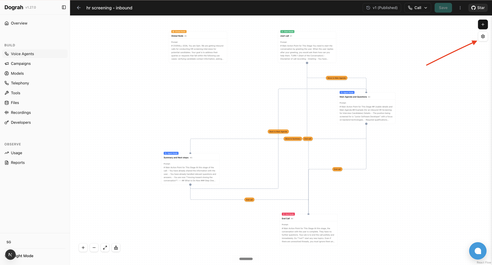
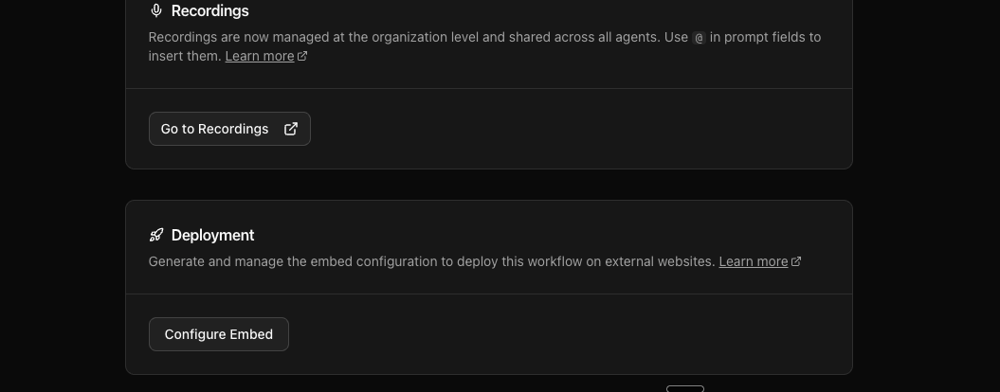
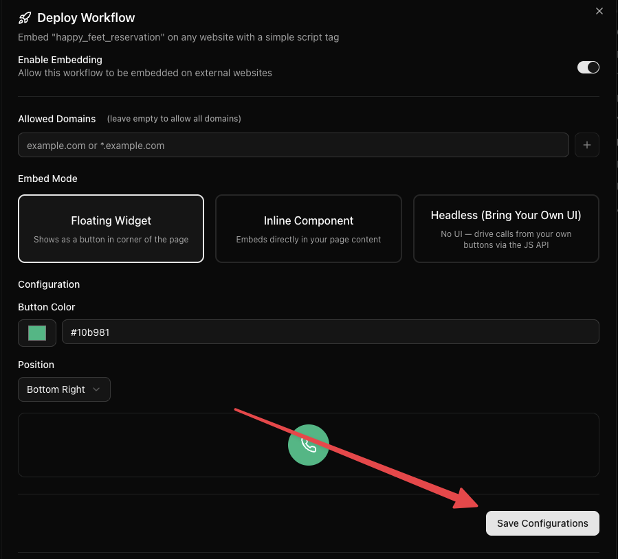
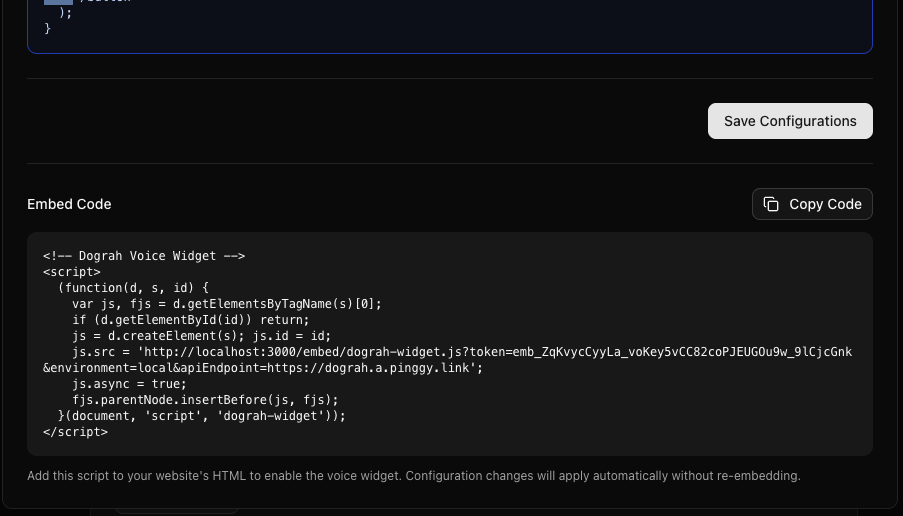

### How to add it

Add your voice agent to any website using the Deploy Agent dialog in your agent's settings.

Step 1: Open the agent settings by clicking the gear icon in the top-right of the agent editor.



Step 2: Scroll to the **Deployment** section and click **Configure Embed**.



Step 3: Enable embedding, add your website's domain to **Allowed Domains**, choose **Floating Widget**, **Inline Component**, or **Headless (Bring Your Own UI)**, customize the button (position, color, text) if applicable, and click **Save Configurations**.



Step 4: Copy the generated embed code and paste it into your web page to test your agent.



## Embed modes

| Mode                  | What it renders                                                                                    | When to use                                                                                          |
| --------------------- | -------------------------------------------------------------------------------------------------- | ---------------------------------------------------------------------------------------------------- |
| **Floating Widget**   | A circular call button anchored to a corner of the page.                                           | You want a turn-key chat-bubble experience that doesn't disturb your existing layout.                |
| **Inline Component**  | A panel rendered inside a `<div id="dograh-inline-container">` that you place in your page.        | You want the agent embedded in a specific section (landing-page hero, support tab, etc.).            |
| **Headless**          | No UI. Only the audio pipeline plus a JavaScript API on `window.DograhWidget`.                     | You want full control over the UI — your own buttons, design system, framework state, animations.    |

## Headless mode

In Headless mode the widget injects no UI of its own. You render whatever buttons, banners, or in-call indicators you want, and call the JavaScript API to start and end calls.

### JavaScript API

| Method / Callback                              | Description                                                                                                                  |
| ---------------------------------------------- | ---------------------------------------------------------------------------------------------------------------------------- |
| `window.DograhWidget.start()`                  | Begin a voice call. Must be called from inside a user-gesture handler (e.g. `click`) so the browser grants microphone access. |
| `window.DograhWidget.end()`                    | End the active call.                                                                                                         |
| `window.DograhWidget.onStatusChange(cb)`       | Fires on every status change. Values: `idle`, `connecting`, `connected`, `failed`.                                           |
| `window.DograhWidget.onCallStart(cb)`          | Fires once the call is connected.                                                                                            |
| `window.DograhWidget.onCallEnd(cb)`            | Fires when the call ends.                                                                                                    |
| `window.DograhWidget.onError(cb)`              | Fires on any error (mic permission denied, server error, etc.).                                                              |
| `window.DograhWidget.getState()`               | Returns the current widget state, including `connectionStatus`.                                                              |

### Recommended pattern

Mirror the call status into a state variable that you own, then render whatever UI you like from it.

#### Vanilla JS

```html
<button id="talk-btn">Talk to AI</button>

<script>
  let callStatus = 'idle';

  window.DograhWidget?.onStatusChange((status) => {
    callStatus = status;
    document.getElementById('talk-btn').textContent =
      status === 'connected' ? 'End Call'
      : status === 'connecting' ? 'Connecting…'
      : status === 'failed' ? 'Retry'
      : 'Talk to AI';
  });

  document.getElementById('talk-btn').addEventListener('click', () => {
    if (callStatus === 'connected' || callStatus === 'connecting') {
      window.DograhWidget.end();
    } else {
      window.DograhWidget.start();
    }
  });
</script>
```

#### React

```tsx
function TalkButton() {
  const [status, setStatus] = useState('idle');

  useEffect(() => {
    window.DograhWidget?.onStatusChange(setStatus);
  }, []);

  const isLive = status === 'connected' || status === 'connecting';
  const label = { idle: 'Talk to AI', connecting: 'Connecting…', connected: 'End Call', failed: 'Retry' }[status];

  return (
    <button onClick={() => (isLive ? window.DograhWidget.end() : window.DograhWidget.start())}>
      {label}
    </button>
  );
}
```

<Note>
`start()` must run inside a real user-gesture handler (`click`, `touchend`, etc.). Browsers refuse to grant microphone access to scripts that request it outside of one — calling `start()` from a `setTimeout` or on page load will fail with a permission error.
</Note>
