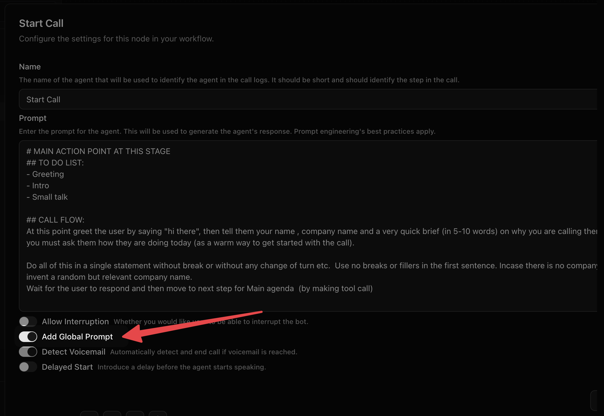

## Video Tutorial

<iframe 
  width="560" 
  height="315" 
  src="https://www.youtube.com/embed/ihMPJ4lCRfA" 
  title="Global Node Tutorial" 
  frameBorder="0" 
  allow="accelerometer; autoplay; clipboard-write; encrypted-media; gyroscope; picture-in-picture; web-share" 
  referrerPolicy="strict-origin-when-cross-origin" 
  allowFullScreen
></iframe>

<Note>
You should have only one Global node per Voice Agent.
</Note>

Global Node is a shared prompt layer for your entire workflow. Write your agent's persona, tone guidelines, and compliance rules once in the **Global Prompt** field. Any Agent Node or Start Call node with "Add Global Prompt" turned on will receive this content prepended to its own prompt before each LLM call.

## What goes in the Global Node

Use Global Node for instructions that apply across every step of the conversation:

- **Persona:** Who is the agent? What company do they represent?
- **Tone rules:** How formal or warm should they be?
- **Compliance guardrails:** What must the agent never say?
- **Objection handling:** How should the agent respond to pushback?

Avoid putting step-specific logic here. Instructions like "offer the settlement option after the debtor confirms their identity" belong in the Agent Node prompt, not in Global.

## How it works

Global Node does not run as a separate step in the call. It has no edges and cannot be connected to other nodes. The Global Prompt is silently prepended to each node's prompt where "Add Global Prompt" is enabled.

The LLM sees one combined prompt: the global content first, followed by the node-specific instructions. The caller never notices the seam.

## Enabling it on an Agent Node

Each Agent Node and Start Call node has an "Add Global Prompt" toggle in its settings panel. Nodes with the toggle off receive no global content for that step.

<Tip>
Turn the toggle off selectively when a specific node needs different behavior. An escalation node, for example, may need a more formal tone that should not inherit your default persona.
</Tip>

## Common mistakes

**Putting node-specific logic in the Global Node.** Global is for rules that always apply, not for conversation-specific decisions. Sequence and outcome logic belong in each Agent Node prompt.

**Leaving the Global Node prompt empty with toggles on.** A blank Global Node prepended to every prompt does nothing harmful, but it is also pointless. Either fill it in or leave the toggle off.

**Adding a second Global Node.** Each workflow supports exactly one. Adding a second throws an error.

## Next Steps

<CardGroup cols={2}>
  <Card title="Start Call Node" href="./start-call">
    Configure how your agent opens the conversation.
  </Card>
  <Card title="Agent Node" href="./agent">
    Build the core conversation logic that inherits your global prompt.
  </Card>
</CardGroup>
