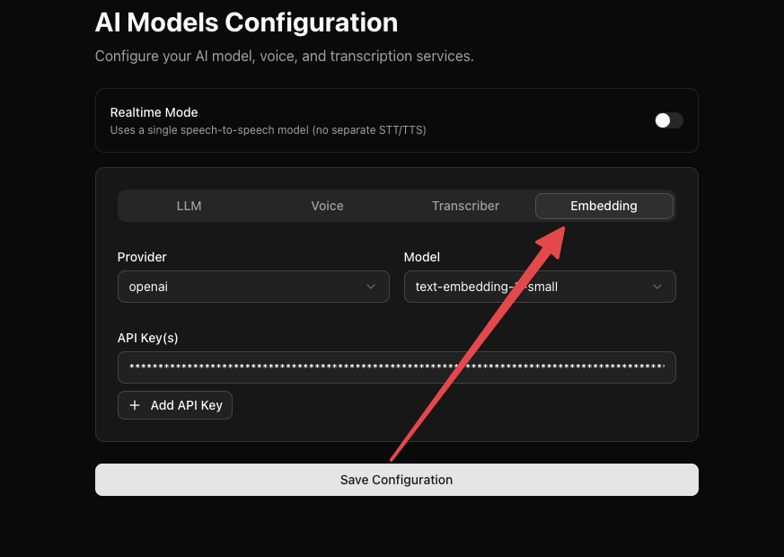

The Knowledge Base lets you upload documents that your voice agents can reference during conversations. Instead of encoding all information into prompts, you can provide source documents and let the agent retrieve relevant content on the fly.

<Warning>
You must configure an embedding provider and API key in **AI Models Configuration → Embedding** before using the Knowledge Base. Document processing and retrieval depend on embeddings, so this feature will not work without a valid embedding configuration.
</Warning>

## How It Works

1. You **upload** a document (PDF, DOCX, TXT, or JSON) to the Knowledge Base
2. Dograh **processes** and chunks the document for efficient retrieval
3. You **attach** the document to one or more workflow nodes
4. During a call, the agent **searches** the document for relevant information based on the caller's questions and uses it to generate accurate responses

## Supported File Types

| Format | Extension |
|--------|-----------|
| PDF    | `.pdf`    |
| Word   | `.docx`, `.doc` |
| Text   | `.txt`    |
| JSON   | `.json`   |

Maximum file size: **5 MB**

## Uploading Documents

1. Go to **Knowledge Base Files** in the dashboard
2. Click **Upload New** or drag and drop a file
3. Wait for processing to complete — the document will be chunked and indexed automatically

## Attaching Documents to Nodes

Once a document is processed, you can attach it to any **Start Call** or **Agent** node in your workflow:

1. Open the node edit dialog
2. Scroll to the **Knowledge Base Documents** section
3. Select one or more documents for the agent to reference

The agent will only search documents attached to the current node, so attach only the documents relevant to that conversation step.

## Best Practices

- **Keep documents focused** — a single topic per document produces better retrieval results than a large multi-topic file
- **Use clear, structured content** — headings, lists, and short paragraphs help the chunking process
- **Attach selectively** — only attach documents relevant to a specific node rather than attaching everything everywhere
- **Keep documents up to date** — re-upload when source information changes to avoid stale answers
